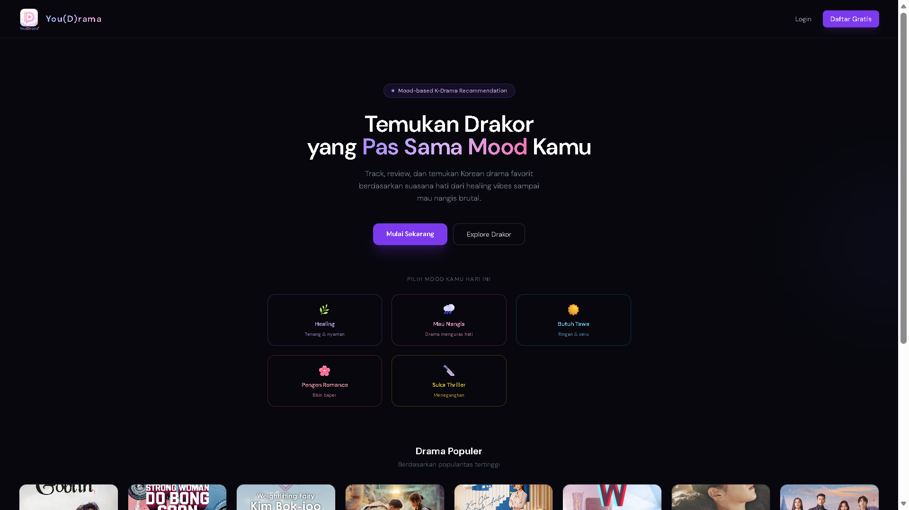
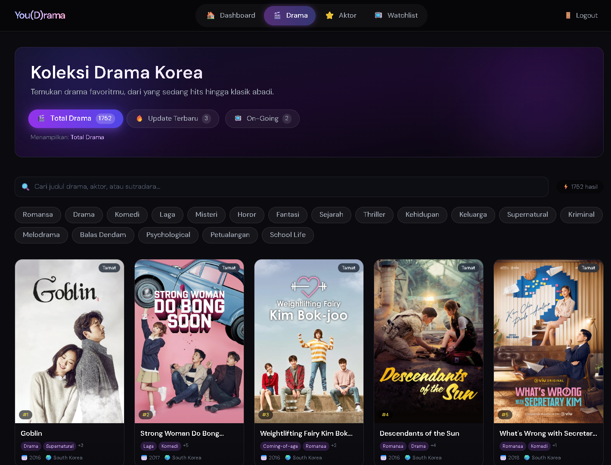
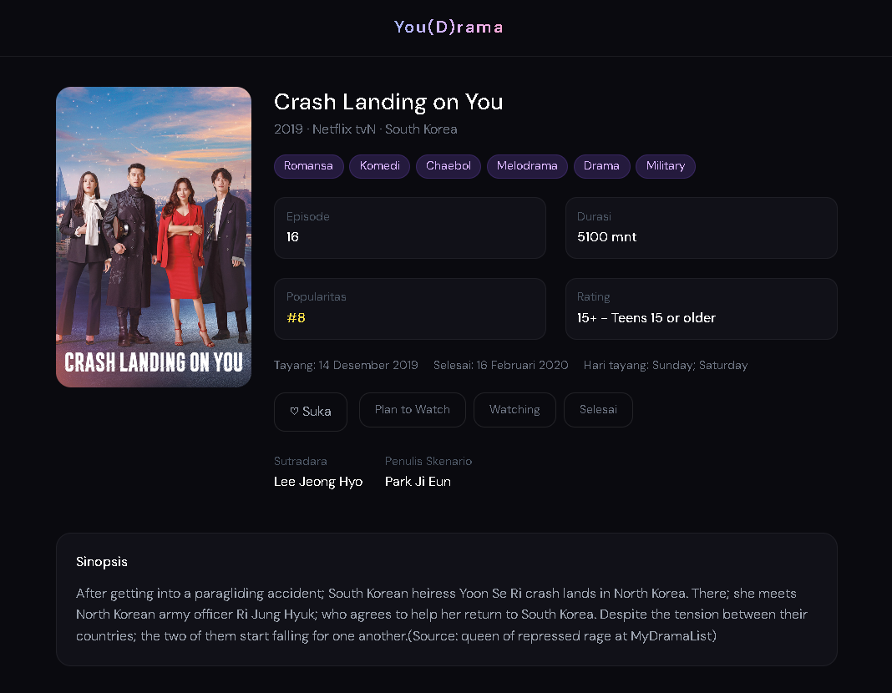
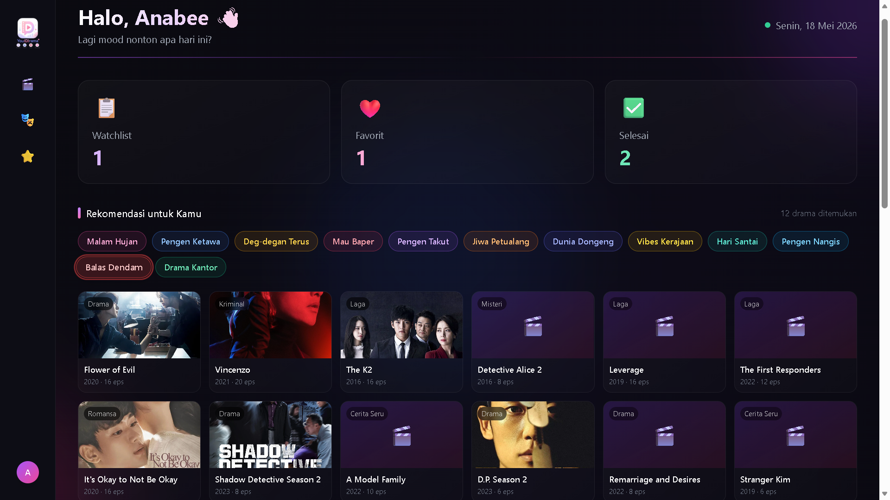
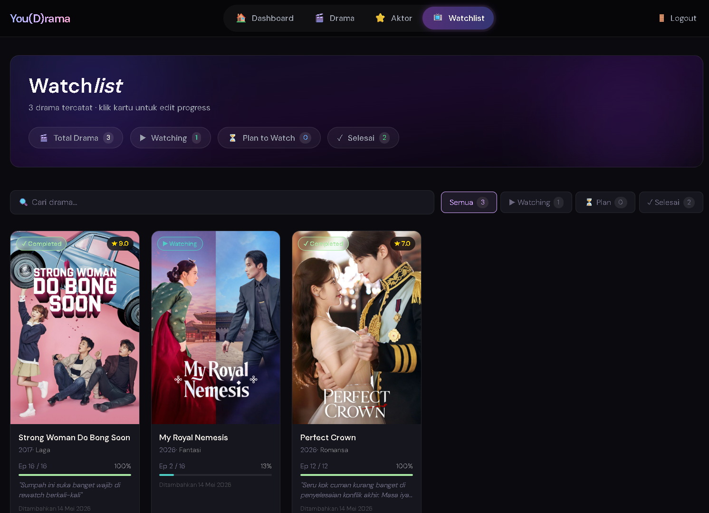
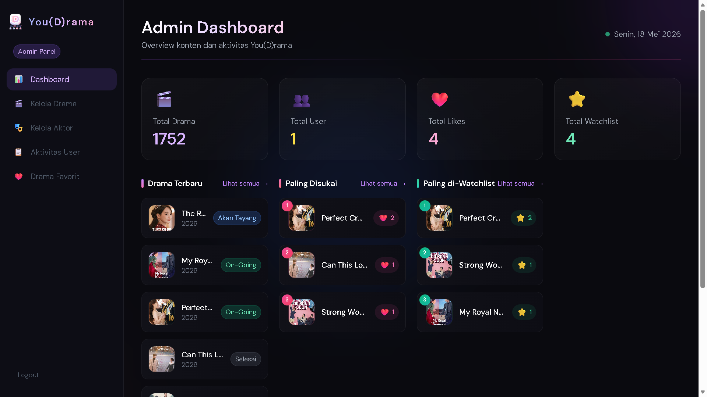

  

# You(D)rama

A web application for K-Drama enthusiasts to discover, track, and get personalized drama recommendations based on mood and watch history.

> **Built with:** Laravel · React · Inertia.js · PostgreSQL · Tailwind CSS

---

## 📸 Screenshots

### Home Page

### Browse K-Dramas

### Drama Detail

### Mood Recommendation

### Watchlist

### Admin Dashboard

---

## ✨ Features

### For Users
- 🔍 **Browse & Search** — Explore a curated list of K-Dramas with search and filter by genre
- ❤️ **Likes & Watchlist** — Save dramas to watchlist and track watch progress
- 🎭 **Mood-Based Recommendation** — Get drama recommendations based on your current mood and genre preference
- 🤖 **Personalized Recommendation** — AI-powered suggestions based on your watch history
- 👤 **User Dashboard** — View your activity, watchlist, and liked dramas in one place

### For Admin
- 📊 **Admin Dashboard** — Monitor user activity, popular dramas, and platform statistics
- 🎬 **Drama Management** — Add, edit, and delete drama entries with poster images
- 🧑‍🎤 **Actor Management** — Manage actor profiles and link them to dramas
- 📋 **Activity Log** — Track all user interactions across the platform

---

## 🛠️ Tech Stack

| Layer | Technology |
|---|---|
| Frontend | React.js, Inertia.js, Tailwind CSS |
| Backend | Laravel 11 (PHP) |
| Database | PostgreSQL |
| Build Tool | Vite |
| Auth | Laravel Session Auth |

---

## 👤 Author

**Aghisna Baihaqi**
- GitHub: [@Aghisnab](https://github.com/Aghisnab)
